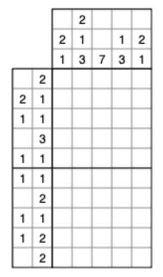

# PICROSS SOLVER

Solver written in javascript ( node.js )

Data is provided as text file. Example data1.txt :
```
10 5
2
2 1
1 1
3
1 1
1 1
2
1 1
1 2
2
2 1
2 1 3
7
1 3
2 1
```
corresponds to this problem :


To execute, run the command
```
node picross.js data1.txt
```

It will produce the following output 
```
[
  [ 0, 1, 1, 0, 0 ],
  [ 0, 1, 1, 0, 1 ],
  [ 0, 0, 1, 0, 1 ],
  [ 0, 1, 1, 1, 0 ],
  [ 1, 0, 1, 0, 0 ],
  [ 1, 0, 1, 0, 0 ],
  [ 0, 0, 1, 1, 0 ],
  [ 0, 1, 0, 1, 0 ],
  [ 0, 1, 0, 1, 1 ],
  [ 1, 1, 0, 0, 0 ]
]
```
corresponding to the solution :

